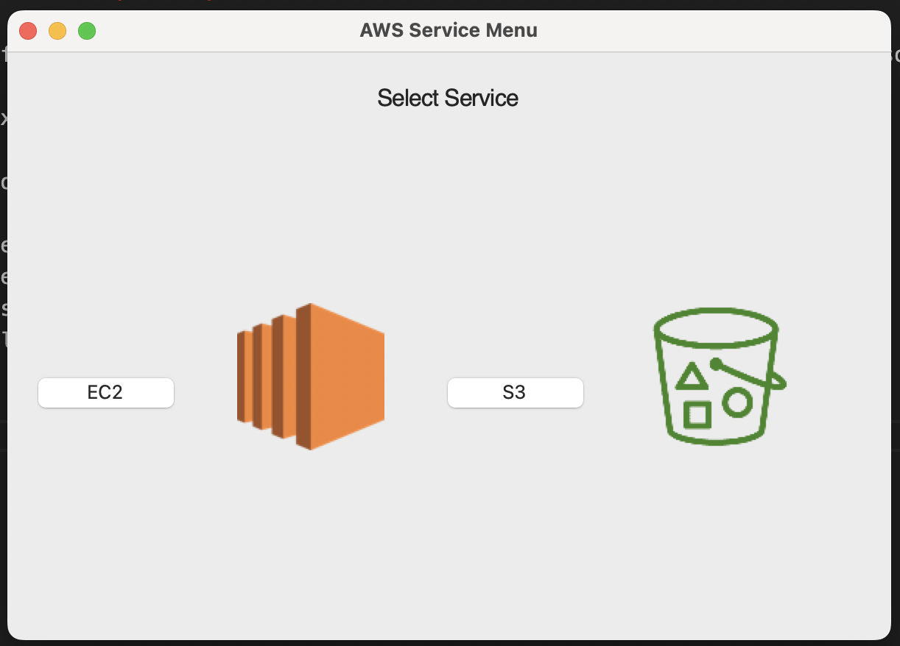

# LAB 3 Assignment

## Exercise a) and b)

The following instructions will execute the exercises of Lab 3. The UI also integrates the methods from Lab 2 including S3 operations. 
1. Execute UI:
```
python main.py
```
2. Select AWS service (EC2 or S3) according to the operation you would like to perform
3. For S3, the following operations are supported:
- Create S3 bucket in different regions
- List objects from an S3 bucket in different regions
- Upload, Download and Delete objects from S3 buckets
4. For EC2, the following operations are available:
- Create EC2 instance
- Stop EC2 instance
- Retrieve staus of EC2 instance
- Retrieve Cloudwatch metrics of EC2 instance.


